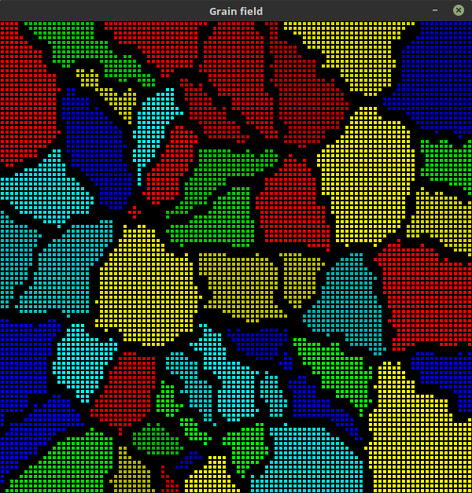
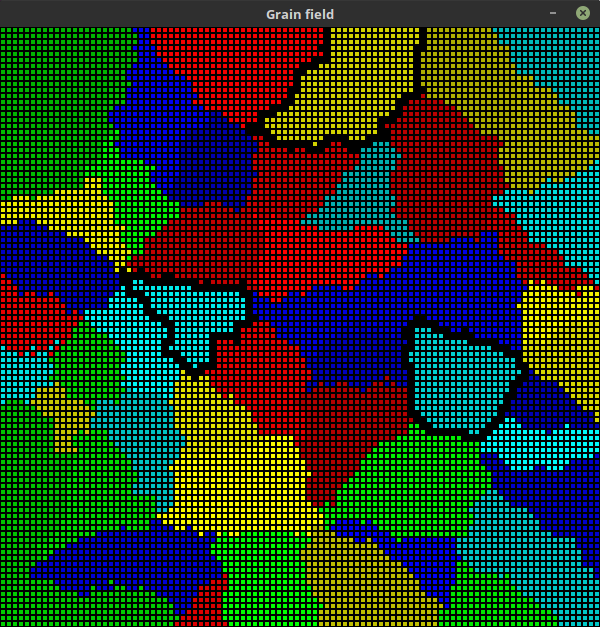
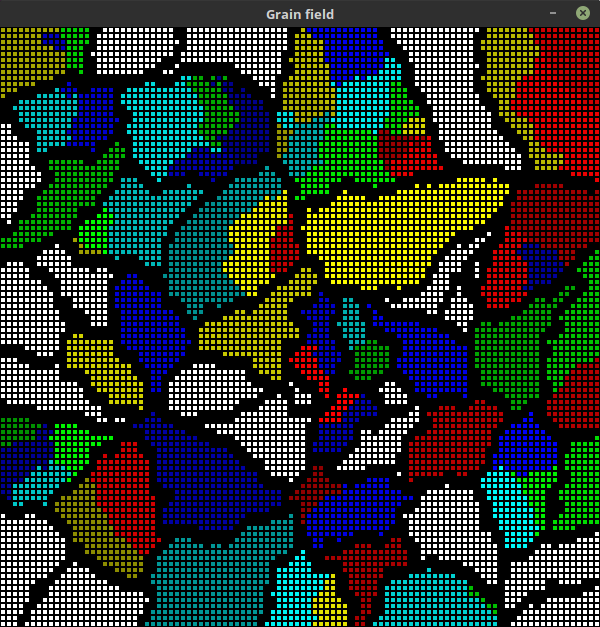

Grain boundaries
=================

User can add boundaries to the field after simulation. He can decide whether he wants to add boundaries to all grains
or only to the selected ones. The process of selecting grains is the same as in :doc:`previous section <substructure>`.

* boundaries for all grains

**Image 9** Boundaries for all grains

* boundaries for selected grains

**Image 10** boundaries for selected grains

After boundaries have been added, the percentage of the surface that they occupy is calculated.
The result is displayed in the left bottom corner of application window.

Clear space
------------

Again, using ``CA -> CA`` button we can clear all grains, leaving boundaries untouched.
Additionally we can run simulation with new grains (**Image 11**).

**Image 11**

Code
-----

Code responsible for finding boundary points.

.. autoclass:: ca.grain_field.GrainField
    :members: grains_boundaries_points