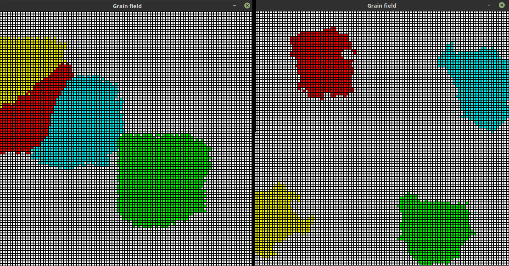

Boundary shape control
=======================

**Probability** slider lets user to control the shape of grain boundaries in some way.

Comparison between simulation results for **probability** values set to **99%** (left) and **1%** (right)

Algorithm
-----------

Future state of an empty cell is determined by checking 4 rules:

#. 5 or more cells from **Moore** neighbourhood
#. 3 or more cells from **nearest** Moore neighbourhood
#. 3 or more cells from **further** Moore neighbourhood
#. any cell from neighbourhood if probability test is positive

Code
-----

.. automodule:: ca.neighbourhood
    :members: decide_by_4_rules

