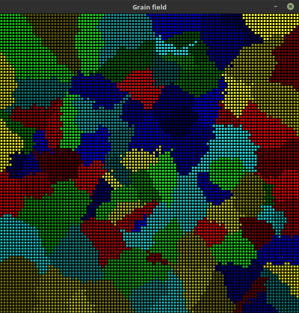

Grain growth
==============

This section allows user to select initial grain field size (width and height).

Additionally number of grains to be added in random positions can be set.

After pressing ``start`` button, visualisation will start running.

**Image 3** Result of grain growth simulation (100x100 field)