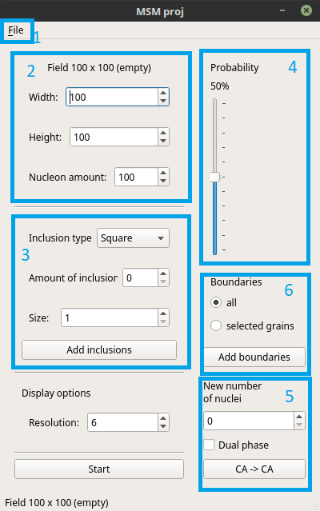

MSM project
===========

Highlighted GUI elements serve different purposes

.. toctree::
    :maxdepth: 1
    :hidden:

    import_export
    graingrowth
    inclusions
    boundary_shape
    substructure
    boundaries

1. :doc:`Import/export functionality <import_export>`
2. :doc:`Grain growth <graingrowth>`
3. :doc:`Inclusions <inclusions>`
4. :doc:`Boundary shape control <boundary_shape>` - extension of Moore neighbourhood
5. :doc:`Substructures <substructure>` (different microstructure type)
6. Adding :doc:`grain boundaries <boundaries>`