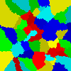

Import and export functionality
================================

Results obtained during simulation can be exported to either text file or image.
Exported files can be imported and simulation may be continued.

Export to text
---------------

Text files are formatted in such way:

* first line contains field dimensions (width, height)
* following lines contain **(x, y)** coordinates and **ids** assigned to them

Example text file

::

    200 200
    0 0 42
    0 1 42
    0 2 42
    0 3 42
    0 4 42
    0 5 42
    0 6 42
    0 7 42
    0 8 42
    0 9 42
    0 10 42
    0 11 42
    0 12 42
    0 13 42
    0 14 42
    0 15 42
    0 16 42
    0 17 42
    0 18 42
    (...)

Images
------

Image export is pretty straightforward - what you see on the screen gets imported to **.png** file.

Saved images can also be imported.

Example image

:download:`Download <../_static/example_image.png>`
