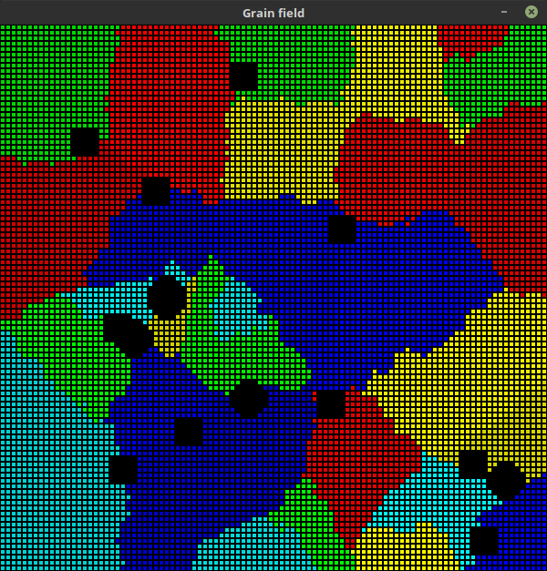

Inclusions
==========

Inclusions functionality involves:

* adding inclusions:

  * before starting simulation
  * after simulation, when the field is filled with grains. Inclusions are added on :doc:`grain boundaries <boundaries>` in this case.

* different shapes of inclusions

  * square
  * circle

Cells which represent inclusion do not affect neighbour cells.
This means that if we add inclusion it will not grow and will not be modified throughout simulation.

Image below presents few circle and square inclusions added *after* filling grain field (after simulation).

Code
-----

Method responsible for adding inclusions

.. autoclass:: ca.grain_field.GrainField
    :members: random_inclusions

Functions for finding calculating coordinates

.. autofunction:: geometry.pixels.circle

.. autofunction:: geometry.pixels.rectangle