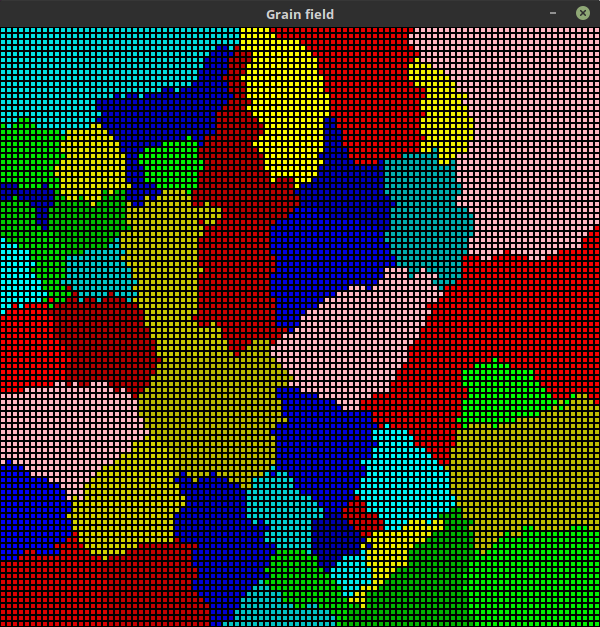
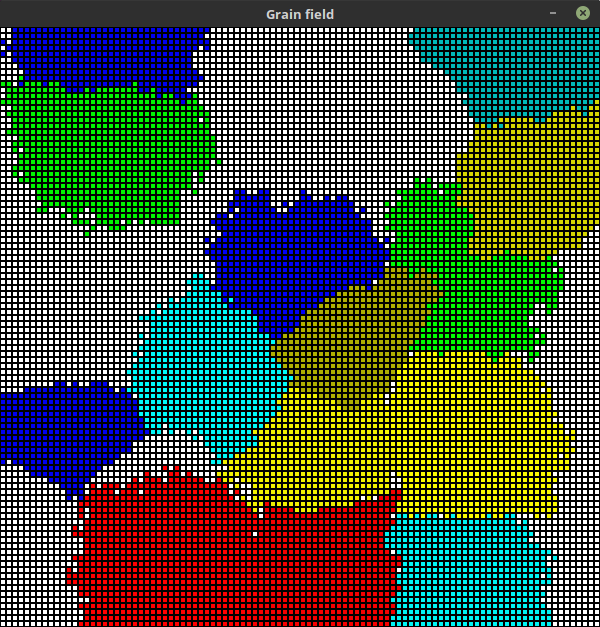
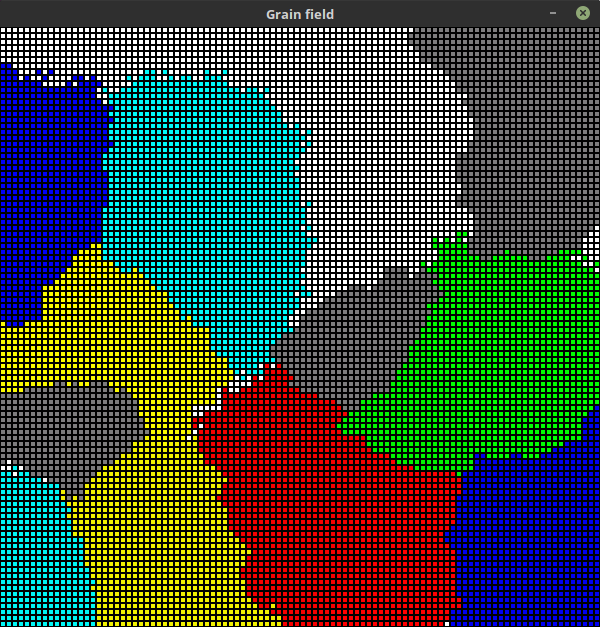

Substructure
=============

During visualisation user can select grains by mouse clicks.

Selected grains are highlighted in light pink color.

After grains have been selected, whole field can be cleared leaving selected grain untouched.

Clicking ``CA -> CA`` button will perform different actions depending of the state of ``Dual phase`` checkbox.

**Unchecked**

Selected grains will maintain their state but after clearing field they won't increase in size.

**Checked**

All selected grains get the same color and also do not grow.

